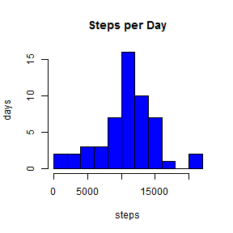
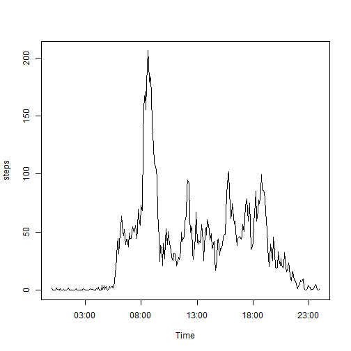
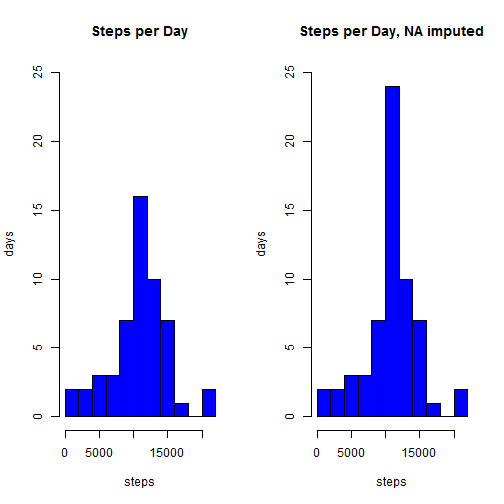
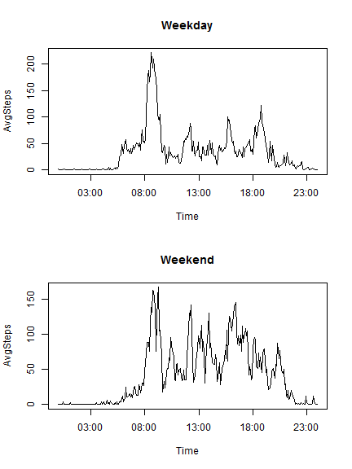

# Reproducible Research: Peer Assessment 1
---
title: "Reproducible Research Peer Assessment 1"
author: "Emily Fagerstrom"
date: "Thursday, January 15, 2015"
output: html_document
---

## Loading and preprocessing the data

UNZIP the *activity.zip* data, if it hasn't been already, and load it into R:


```r
unzip("activity.zip", overwrite=FALSE, exdir=".")
```

```
## Warning in unzip("activity.zip", overwrite = FALSE, exdir = "."): not
## overwriting file './activity.csv
```

```r
data<-read.csv("activity.csv", header=TRUE)
```

Note to self: This seems to overwrite it every time, even if the file exists and nothing has changed???


## What is mean total number of steps taken per day?

Goal: want to find the sum of *steps* for each factor level of *date*


```r
stepsPerDay<-with(data,aggregate(steps ~ date, FUN = sum, na.rm=TRUE))

head(stepsPerDay)
```

```
##         date steps
## 1 2012-10-02   126
## 2 2012-10-03 11352
## 3 2012-10-04 12116
## 4 2012-10-05 13294
## 5 2012-10-06 15420
## 6 2012-10-07 11015
```


Goal: read the date column as dates


```r
library(timeDate)

stepsPerDay$date<-as.Date(stepsPerDay$date,"%Y-%m-%d")

head(stepsPerDay)
```

```
##         date steps
## 1 2012-10-02   126
## 2 2012-10-03 11352
## 3 2012-10-04 12116
## 4 2012-10-05 13294
## 5 2012-10-06 15420
## 6 2012-10-07 11015
```


Goal: create a histogram of the data


```r
hist(stepsPerDay$steps,col="blue",main="Steps per Day",xlab="steps",ylab="days",breaks=10)
```

 

```r
dev.copy(png, file="img1Histogram.png")
```

```
## png 
##   3
```

```r
dev.off()
```

```
## pdf 
##   2
```


Goal: find the mean and median number of steps taken per day:


```r
summary(stepsPerDay$steps)[c(4,3)]
```

```
##   Mean Median 
##  10770  10760
```


## What is the average daily activity pattern?

Goal: find the average daily pattern


```r
avgStepsPerInt<-with(data,aggregate(steps ~ interval, FUN = mean, na.rm=TRUE))
```

Goal: write the interval as a time.


```r
time<-function(interval){
    hr <- floor(interval/100)
    min <- interval-hr*100
    time = paste(as.character(hr),"-",as.character(min),sep="")
}
data$time <- time(data$interval)

avgStepsPerInt$Time <- strptime(time(avgStepsPerInt$interval), format = "%H-%M")
```

Goal: plot a time series of the average day.


```r
with(avgStepsPerInt, plot(Time,steps,type="l"))
```

 

```r
dev.copy(png, file="img2TimeSeries.png")
```

```
## png 
##   3
```

```r
dev.off()
```

```
## pdf 
##   2
```

Goal: which interval has, on average, the most steps?


```r
avgStepsPerInt[avgStepsPerInt$steps==max(avgStepsPerInt$steps),1]
```

```
## [1] 835
```


## Imputing missing values

Goal: How many NA's are there in the steps variable?


```r
sum(is.na(data[,1]))
```

```
## [1] 2304
```
Just to check... there are no other NA's in any other column:


```r
sum(is.na(data[,2]))+sum(is.na(data[,3]))
```

```
## [1] 0
```


I am using a for loop this is the WORSTEST!!!!


```r
dataNoNA<-data

for(i in 1:length(dataNoNA[,1])){
    if(is.na(dataNoNA[i,1])){
        dataNoNA[i,1]<-avgStepsPerInt[avgStepsPerInt$interval==dataNoNA[i,3],2]
    }
}

head(dataNoNA)
```

```
##       steps       date interval time
## 1 1.7169811 2012-10-01        0  0-0
## 2 0.3396226 2012-10-01        5  0-5
## 3 0.1320755 2012-10-01       10 0-10
## 4 0.1509434 2012-10-01       15 0-15
## 5 0.0754717 2012-10-01       20 0-20
## 6 2.0943396 2012-10-01       25 0-25
```

Goal: create a histogram of the data


```r
stepsPerDayNoNA<-with(dataNoNA,aggregate(steps ~ date, FUN = sum, na.rm=TRUE))


par(mfrow=c(1,2))
hist(stepsPerDay$steps,col="blue",main="Steps per Day",xlab="steps",ylab="days",breaks=10,ylim=c(0, 25))
hist(stepsPerDayNoNA$steps,col="blue",main="Steps per Day, NA imputed",xlab="steps",ylab="days",breaks=10,ylim=c(0, 25))
```

 

```r
dev.copy(png, file="img3HistogramNAimputed.png")
```

```
## png 
##   3
```

```r
dev.off()
```

```
## pdf 
##   2
```


Goal: find the mean and median number of steps taken per day, given that NA values were imputed:


```r
summary(stepsPerDayNoNA$steps)[c(4,3)]
```

```
##   Mean Median 
##  10770  10770
```

So...the mean remained the same; the median went up.


## Are there differences in activity patterns between weekdays and weekends?


Goal: Add a column to the new data frame, which includes the weekday.


```r
dataNoNA$day<-weekdays(as.Date(dataNoNA$date,"%Y-%m-%d"))
```

Goal: turn the days of the week into "weekday" and "weekend".  

This is ugly.
There is probably a way to do this nicely in one go... with 
"c("Monday", "Tuesday", ...)" c("weekday", "weekday", ...)


```r
dataNoNA[,5]<-gsub("Monday", "weekday", dataNoNA[,5], ignore.case = FALSE)
dataNoNA[,5]<-gsub("Tuesday", "weekday", dataNoNA[,5], ignore.case = FALSE)
dataNoNA[,5]<-gsub("Wedday", "weekday", dataNoNA[,5], ignore.case = FALSE)
dataNoNA[,5]<-gsub("Thursday", "weekday", dataNoNA[,5], ignore.case = FALSE)
dataNoNA[,5]<-gsub("Friday", "weekday", dataNoNA[,5], ignore.case = FALSE)
dataNoNA[,5]<-gsub("Saturday", "weekend", dataNoNA[,5], ignore.case = FALSE)
dataNoNA[,5]<-gsub("Sunday", "weekend", dataNoNA[,5], ignore.case = FALSE)
```

Goal: build a dataframe from *dataNoNA* which takes the mean of the steps, conditioned on the time interval, and the type of day.


```r
avgStepsPerIntByDaytype<-with(dataNoNA,aggregate(steps, list(interval,day), FUN = mean))
colnames(avgStepsPerIntByDaytype)<-c("interval","DayType","AvgSteps")
```

Goal: use the time function built above.


```r
avgStepsPerIntByDaytype$Time <- strptime(time(avgStepsPerIntByDaytype$interval), format = "%H-%M")


par(mfrow=c(2,1))
with(subset(avgStepsPerIntByDaytype, DayType == "weekday"), plot(Time,AvgSteps,type="l", main="Weekday"))
with(subset(avgStepsPerIntByDaytype, DayType == "weekend"), plot(Time,AvgSteps,type="l", main="Weekend"))
```

 

```r
dev.copy(png, file="img4TimeSeriesWkendWkday.png")
```

```
## png 
##   3
```

```r
dev.off()
```

```
## pdf 
##   2
```

Seems to get up a little later and walk a lot more on weekends.
